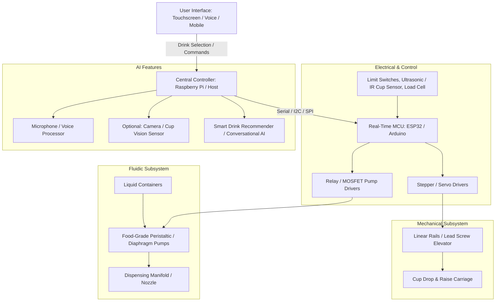

# System Architecture & Subsystem Breakdown

> [!WARNING]
> **PRELIMINARY ESTIMATE / DRAFT CONCEPT — NOWHERE NEAR FINAL**  
> This architectural breakdown outlines exploratory candidate subsystems for the ideation phase. All mechanisms, fluidic choices, electronics, and software components are rough design drafts subject to change.

---

---

## 2. Subsystem Breakdown

### 2.1 Subsystem A: Mechanical & Structural
- **Form Factor**: Mobile side table on **4x heavy-duty lockable caster wheels** for seamless table-side hospitality service.
- **Internal Mechanics Envelope**: Approximately **`30" L × 17" W × 10" H`** internal machinery enclosure.
- **Viewing Chamber**: Clear acrylic / polycarbonate side-panel allowing presentation visibility of moving internal mechanisms.
- **Cup Elevator Mechanism (Lead: Eli & Shyam)**:
  - Linear motion: Linear guide rails + NEMA stepper motor driven by timing belt/pulley or 8mm lead screw.
  - End-stop safety: Hardware limit switches (optical or mechanical) at top (pickup) and bottom (dispense) positions.
  - Fixed Cup Design: Single standard cup size selected to ensure repeatable nozzle centering, lift alignment, and zero spillage.

### 2.2 Subsystem B: Fluidics & Dispensing (Lead: Ro & Aron)
- **8-Bottle Capacity**: Linear **2 rows of 4** layout (4 non-alcoholic mixers/juices, 4 spirits/liquors) for clean spatial organization and easy refilling.
- **Custom Flat-Bottom Bottles**: Fixed-dimension flat-bottom vessels ensuring level liquid drawdown and stable carriage mounting.
- **Sanitary Closures & Vacuum Relief**: Food-grade rubber corks incorporating one-way duckbill check valves for ambient air replacement during pump suction.
- **Pumps & Inline Flow Regulation**:
  - Food-grade 12V peristaltic dosing pumps (self-priming, fluid never contacts pump motor).
  - Individual **inline flow regulators** on each fluid line to meter pour velocity and prevent splash/aeration.
  - Non-carbonated beverages strictly enforced (carbonation requires dedicated pressure containment).
- **Sanitation**: Removable bottles and tubing disconnects for rapid flush cycles.

### 2.3 Subsystem C: Thermal Management & Ice (Lead: Shyam & Eli)
- **Thermal Baseline**: Insulated cold bay utilizing **reusable food-grade stainless steel ice cubes** or compact thermoelectric peltier chiller.
- **Design Tradeoff**: Bulky motorized ice makers and compressor units were permanently dropped for the prototype due to plumbing, drainage, and volume constraints.

### 2.4 Subsystem D: Electrical & Industrial Controls (Lead: Eli & Ro)
- **Industrial PLC Architecture**:
  - **PLC Controller**: Industrial Programmable Logic Controller (e.g., Click PLC or Siemens LOGO!) selected over basic Arduino for industrial ladder logic, noise immunity, and course rigor.
  - **Spill-Proof Placement**: Electronics box, 24V DC power supply, and relay blocks mounted **high on the rear bulkhead** away from any possible liquid drip paths.
- **Control Interface**:
  - Prototype: Durable tactile push-buttons for drink selection.
  - Future Phase Upgrade: Integrated touchscreen HMI.

### 2.4 Subsystem D: Software, UI & AI Integration
- **Local Embedded Firmware (C++/Arduino/FreeRTOS)**:
  - Finite State Machine (IDLE -> LOWERING -> DISPENSING -> RAISING -> READY).
  - Emergency Stop (E-Stop) and fault handling.
- **High-Level OS & UI (Raspberry Pi / Linux)**:
  - Python / FastAPI backend or Electron / Flutter touchscreen GUI.
  - Bluetooth / Web-based smartphone order companion.
- **AI Integration**:
  - Voice Command Processing (Wake-word + speech-to-intent).
  - Conversational Drink Recommender (LLM-based mood/flavor mixer).
  - Cup Fill Level & Type Detection via OpenCV.
