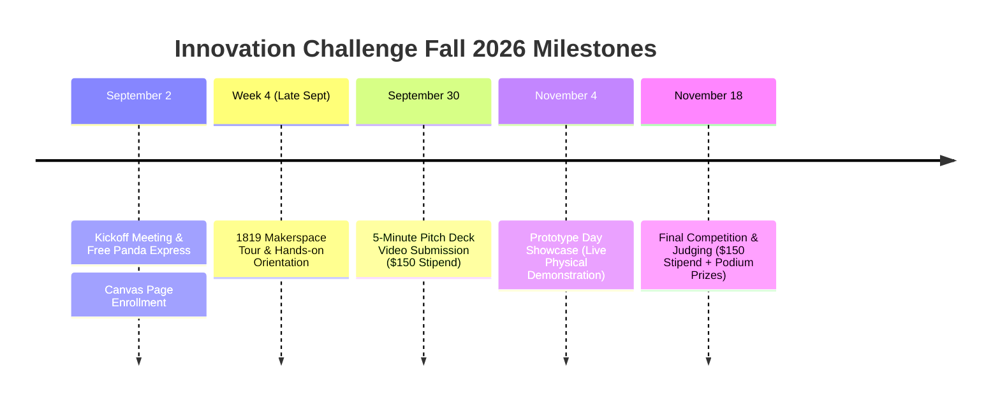

# CEAS Tribunal Innovation Challenge (Fall 2026) — Complete Guide & Roadmap

**Source Document**: [`Budget/Week_01_Fall2026.pptx`](file:///c:/Users/rohen/Videos/Senior%20Design/Budget/Week_01_Fall2026.pptx)  
**Presented**: Wednesday, September 2, 2026 @ 5:30 PM (Kautz Attic, Lindner Hall 4350)  
**Leadership**: 
- Program Director: Dr. Jason Heikenfeld (Director of "Next Mindset" Initiative, most patents in UC history)
- Student Leadership: Matthew Bish (President), Elizabeth Watson (Chief of Staff), Kailyn Abell (IC Program Manager), Andrew Lewis, Julia White

---

## 💰 1. Prize Money & Stipend Breakdown

| Award / Milestone | Amount ($) | Eligibility & Requirements |
| :--- | :---: | :--- |
| **Active Participation Stipend #1** | **$150.00** | Awarded upon submission of the **5-Minute Pitch Deck Video** (Due: Sept 30). |
| **Active Participation Stipend #2** | **$150.00** | Awarded upon completing **Prototype Day (Nov 4)** and attending the **Final Competition (Nov 18)**. |
| **Top 25% Performance Bonus** | **$300.00** | Awarded to teams finishing in the top quartile of judges' scoring. |
| **Podium Prizes (1st, 2nd, 3rd Place)** | **Bonus Prizes** | Top monetary tier and ceremonial giant check for winning teams. |
| **Total Guaranteed for Completion** | **$300.00** | Minimum stipend earned simply by fulfilling the 3 semester milestones. |
| **Total Potential Winnings** | **$600.00 – $1,000+** | With top 25% placement and podium awards. |

---

## 🛠️ 2. Material Reimbursements & 1819 Makerspace Access

- **100% Cost of Materials Covered**: The Innovation Challenge reimburses hardware, raw materials, fasteners, and electronics purchased for the project.
- **1819 Makerspace Tour (Week 4)**: All resources, equipment, 3D printers, laser cutters, and waterjets at the UC 1819 Makerspace are available and eligible for reimbursement.
- **Purchasing & Reimbursement Workflow**:
  1. Download the **Purchase Request Excel Template** from the Innovation Challenge Canvas page.
  2. Complete itemized cost breakdown and submit on Canvas for pre-approval.
  3. Keep all itemized vendor receipts (Amazon, McMaster-Carr, Lowe's, etc.).
  4. Submit final reimbursement request after the Final Competition (Nov 18) to receive payout.
- ⚠️ **Policy Constraints**: Software/AI subscriptions (e.g., ChatGPT/cloud tools) are **not** eligible for reimbursement; funds must be directed to tangible prototype materials.

---

## 📅 3. Semester Critical Milestone Deadlines

### Milestone Details:
1. **Milestone 1: 5-Minute Pitch Deck Video (Due: Wednesday, Sept 30, 2026)**
   - Format: Recorded 5-minute video presentation.
   - Core Content: Problem statement, market need (breweries/cigar lounges), product concept (Automated Drink Dispenser table), initial CAD/sketches, and preliminary budget.
   - **Payout**: Unlocks first **$150.00** team stipend.
2. **Milestone 2: Prototype Day (Wednesday, November 4, 2026)**
   - Format: In-person physical exhibition.
   - Requirement: Rough physical proof-of-concept operational (3–4 drink dosing manifold and elevator test rig).
   - Attendance: At least one team member must attend and present the benchtop rig.
3. **Milestone 3: Final Competition & Gala (Wednesday, November 18, 2026)**
   - Format: Formal judging, live pitch, and prototype demonstrations to industry experts.
   - Attendance: All team members required to attend.
   - **Payout**: Unlocks second **$150.00** stipend + eligibility for **$300 top 25% bonus** and 1st/2nd/3rd place awards.

---

## 🎓 4. University Honors Program (UHP) Credit
- Completion of all 3 Innovation Challenge requirements officially satisfies **1 UHP (University Honors Program) Experience**.
- Retroactive credit is supported via `uc.edu/honors`.
