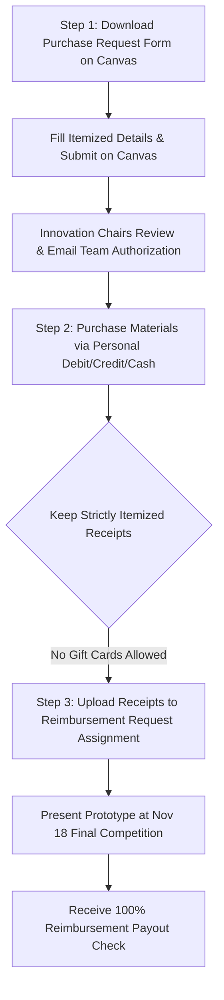

# CEAS Tribunal Innovation Challenge (Fall 2026) — Complete Official Guide & FAQ

**Program**: CEAS Tribunal & UC Center for Entrepreneurship Innovation Challenge  
**Weekly Sessions**: Wednesdays @ 5:30 PM – 6:30 PM | Kautz Attic (Lindner Hall 4350)  
**Executive Director**: Dr. Jason Heikenfeld ("Next Mindset" Initiative, most patents in UC history)  
**Student Chairs & Leadership**: Matthew Bish (President), Elizabeth Watson (Chief of Staff), Kailyn Abell, Andrew Lewis, Julia White  
**Official Email**: `g-InnovationChallenge@mailuc.onmicrosoft.com` / `innovation-challenge@ucmail.uc.edu`  

---

## 🔗 Master Link Directory & Resources

| Resource | Official Link | Description / Purpose |
| :--- | :--- | :--- |
| **Official Interest / Registration Form** | [forms.office.com/r/yApYp82x9S](https://forms.office.com/r/yApYp82x9S) | Required registration form for all participants. |
| **Alternate Registration Link** | [forms.office.com/r/8ghh6TR91h](https://forms.office.com/r/8ghh6TR91h) | Secondary link via business card/flyer QR code. |
| **CEAS Tribunal Slack Workspace** | [ceastribunal.slack.com](https://ceastribunal.slack.com/) | Primary real-time communication channel (`#innovation-challenge`). |
| **Official Pitch Deck PPT Template** | [cdn2.me-qr.com/pdf/17693376.pdf](https://cdn2.me-qr.com/pdf/17693376.pdf) | Required slide presentation layout for Milestone 1 video. |
| **1819 Innovation Hub Website** | [uc1819.com](https://uc1819.com/) | 12,000 sq ft Makerspace (3D printers, CNC, waterjet, metal/wood shops). |
| **University Honors Program (UHP)** | [uc.edu/honors](http://uc.edu/honors) | Self-designed proposal for 1 Honors Experience (Contact: Vikki Kowalczyk `bernotvi@ucmail.uc.edu`). |
| **General Challenge Email** | `g-InnovationChallenge@mailuc.onmicrosoft.com` | Official inbox for all challenge questions and team approvals. |
| **1819 Makerspace Pre-Charge Email** | `innovation-challenge@ucmail.uc.edu` | Email Elizabeth, Andrew, or Julia *before* charging to 1819 Hub. |

---

## 💰 1. Prize Money & Guaranteed Stipend Breakdown

- **Guaranteed Participation Stipend**: **$300.00 per engineering student** ($1,200.00 team total for 4 members) for completing all 3 deliverables:
  1. **$150.00 / person ($600.00 Team Total)**: Paid upon submission of the **5-Minute Pitch Deck Video** (Due: Sept 28/30).  
     *Note: Submitting the pitch deck is mandatory to qualify for the second $150 stipend!*
  2. **$150.00 / person ($600.00 Team Total)**: Paid upon attending **Prototype Day (Nov 4)** and the **Final Competition (Nov 18)**.
- **Top 25% Quartile Bonus**: Additional **$300.00 per person ($1,200.00 team bonus)** based on final judges' scores.
- **Podium Grand Prizes (1st, 2nd, 3rd Place)**: Up to **$700.00 per person ($2,800.00 team prize)** + ceremonial giant check.
- **Total Potential Team Earnings**: **$1,200 guaranteed** up to **$4,000+** with bonuses and podium awards.

---

## 🛠️ 2. Step-by-Step Material Reimbursement Protocol

The Innovation Challenge covers **100% of physical prototype material costs** (equipment at 1819, 3D printing filament, CNC, waterjet, welding, fasteners, pumps, and electronics). Reimbursement checks are distributed after the November 18th Final Competition.

### Critical Rules for Reimbursement:
1. **Pre-Authorization is Mandatory**: Submit the **Purchase Request Form** on Canvas with as much detail as possible. **DO NOT purchase any materials before receiving written authorization from the Innovation Chairs.**
2. **Itemized Receipts Required**: Receipts must clearly state:
   - Vendor name
   - Date and time of purchase
   - Itemized description and unit price
   - Quantity purchased
   - Sales tax
3. **NO GIFT CARDS**: Purchases made using gift cards are strictly **ineligible for reimbursement**.
4. **Software Excluded**: Hardware and materials only; software/AI tool subscriptions cannot be reimbursed.
5. **1819 Makerspace Pre-Charge**: If charging directly to the 1819 Makerspace account, you **must email Elizabeth, Andrew, or Julia** at `innovation-challenge@ucmail.uc.edu` *before* using the space.

---

## ❓ 3. Official Innovation Challenge FAQ (Verbatim Q&A)

### Q1: What is the Innovation Challenge?
The Innovation Challenge is a semester-long program hosted by the CEAS Tribunal and the Center for Entrepreneurship. Students develop an entrepreneurial idea, build a pitch deck, construct an operational prototype, and present at the final competition. Students receive $300+ for participating, network with mentors, collaborate on hardware, and receive free food every Wednesday from 5:30 to 6:30 in Kautz Attic (Lindner 4350).

### Q2: What do I need to know to join?
Nothing! No business or marketing background is required. The challenge teaches pitch deck development, presentation to industry judges, and general entrepreneurship practices.

### Q3: How do I join?
Show up Wednesday @ 5:30 in Kautz Attic (Lindner 4350). Fill out the [Official Interest Form](https://forms.office.com/r/yApYp82x9S) or scan the flyer QR code. Join the [CEAS Tribunal Slack](https://ceastribunal.slack.com/) in the `#innovation-challenge` channel. Email `g-InnovationChallenge@mailuc.onmicrosoft.com` for questions.

### Q4: How do I earn the $300 for participating?
Engineering students are automatically eligible for the $300 stipend. (Non-engineering students earn $300 by pairing with an engineering student). Requirements:
1. Submit an initial 5-minute pitch deck presentation video.
2. Participate in Prototype Day (Nov 4).
3. Present in the Final Competition (Nov 18).

### Q5: What links and documents do I need to access throughout the semester?
- **Interest Form**: [forms.office.com/r/yApYp82x9S](https://forms.office.com/r/yApYp82x9S)
- **Slack Workspace**: [ceastribunal.slack.com](https://ceastribunal.slack.com/)
- **Email Contact**: `g-InnovationChallenge@mailuc.onmicrosoft.com`
- **Pitch Deck Template**: [cdn2.me-qr.com/pdf/17693376.pdf](https://cdn2.me-qr.com/pdf/17693376.pdf)

### Q6: Which events do I have to participate in?
Eligible students receive **$150 for the pitch deck submission** and **$150 for participating in prototyping day and the final competition**. Pitch deck submission is mandatory to qualify for the second $150 stipend. To receive material cost reimbursements, teams MUST participate in the final competition and show a working physical prototype.

### Q7: What is the process for buying prototyping materials and receiving a refund?
1. Complete the "Purchase Request" Assignment on Canvas with as much detail as possible.
2. Innovation Chairs review and email authorization to the whole team. **DO NOT buy materials before approval.**
3. Buy materials using credit card, debit card, or cash. Ensure receipts are fully itemized. **NO GIFT CARDS.**
4. Submit itemized receipts to the "Reimbursement Request" Canvas assignment.
5. Following attendance at the Final Competition, reimbursement checks are distributed.

### Q8: What is the 1819 Innovation Hub, and how do I get a refund for expenses?
The 1819 Hub features a 12,000 sq ft makerspace with SLA/FDM 3D printers, full metal shop (TIG/MIG welders, CNC mills/routers, waterjet, plasma cutter, sandblaster), and wood shop (table saw, jointer, miter saw, lathe, sander). Check out [uc1819.com](https://uc1819.com/). **If you intend to charge to the makerspace, let Elizabeth, Andrew, or Julia know at `innovation-challenge@ucmail.uc.edu` BEFORE using the space.**

### Q9: Do I have to come to every meeting?
Attendance at the **Final Competition (Nov 18) is mandatory**, and teams are strongly encouraged to attend **Prototype Day (Nov 4)**. Case-by-case exceptions for prototype day can be arranged if the prototype is demonstrated at an alternate time.

### Q10: How can I become part of the Innovation Challenge committee?
Contact `innovation-challenge@ucmail.uc.edu` to help with operations and promotion.

### Q11: Can I receive Honors Credit for participating?
Yes! The Innovation Challenge qualifies as an **Honors Experience** for the University Honors Program (UHP). Submit a self-designed proposal via [uc.edu/honors](http://uc.edu/honors) or contact **Vikki Kowalczyk** at `bernotvi@ucmail.uc.edu`.

### Q12: Can graduate students participate?
Yes! Graduate students are eligible for all prizes, material reimbursements, free food, and the $300 engineering stipend.

### Q13: Can I do my Senior Design project for the Innovation Challenge?
**YES!** Senior design projects are an officially recognized, excellent choice. The Innovation Challenge will fund your project's hardware costs and give you a huge head start for your course milestones.

### Q14: Can I work on an idea I have worked on before?
You cannot repeat an idea previously entered in the Innovation Challenge. Continuing ventures are transitioned through Candace Wade at the Center for Entrepreneurship.
