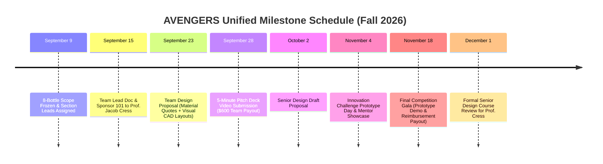

# Project Team Meeting Minutes — September 9, 2026

**Project**: Automated Drink-Dispensing Table (Senior Design Capstone — MECH5051 / EECE5001)  
**Date & Time**: Wednesday, September 9, 2026 | Convened Before & After 1:30 PM Class  
**Location**: University of Cincinnati, CEAS Campus  
**Attendees**: Ro (Project Manager / Lead), Aron (Finance & Bottling), Eli (Electrical & Lift), Shyam (Timeline, Lift & Ice)  
**Document Author**: J.A.R.V.I.S. / Ro  

---

## 📋 1. Executive Summary & Critical Meeting Decisions

The team convened for an extensive design-alignment and scope-freezing session following the Innovation Challenge kickoff. The project architecture was formally expanded from a 3–4 drink benchtop test to an **8-bottle automated drink dispensing side table on wheels** (`~30" × 17" × 10"`). 

The team unified the **Senior Design course milestones** and the **CEAS Innovation Challenge** into a single master schedule to avoid friction, and formally established subsystem section leads.

---

## 🛠️ 2. Subsystem Section Leads & Engineering Assignments

| Subsystem Section | Assigned Leads | Key Deliverables & Responsibilities (Due: **Sept 23**) |
| :--- | :--- | :--- |
| **Project Lead & Architecture** | **Ro** | Overall system integration, design review sign-off, J.A.R.V.I.S. telemetry, sponsor/course lead doc. |
| **Electrical Subsystem** | **Eli** *(Lead)*, **Ro** | Research & spec **Industrial PLC** (ladder logic vs. microcontroller), 24V DC power supply, relays, high-wall spill-proof mounting. |
| **Lift Mechanism** | **Eli** *(Co-Lead)*, **Shyam** *(Co-Lead)* | Z-axis linear rail, stepper motor, pulley/belt or lead screw drive, optical limit switches, platform layout drawing. |
| **Bottling & Fluidics** | **Ro** *(Co-Lead)*, **Aron** *(Co-Lead)* | 8 custom flat-bottom bottles (2x4 array), rubber cork seals, anti-vacuum air relief valves, peristaltic pumps, inline flow regulators. |
| **Ice & Thermal System** | **Shyam**, **Eli** | Evaluate reusable metal ice cubes vs. compact thermoelectric mini-chiller. (Complex compressor ice machine dropped for prototype). |
| **Operations & Gantt** | **Shyam** | Integrate unified roadmap (Sept 15, Sept 23, Sept 28, Oct 2, Nov 4, Nov 18, Dec 1) into Master Gantt Chart. |

---

## 📐 3. Frozen Technical Scope & Hardware Specifications

```
                       +-------------------------------+
                       |   Button (Future Touch HMI)   |
+----------------------+-------------------------------+
|  ELECTRICAL (High)   |                               |
|  • Industrial PLC    |                               |
|  • 24V DC Supply     |       LIFT MECHANISM          |
|  • Relay Blocks      |  • Z-Axis Linear Rail         |
|  • Safe Wiring Box   |  • Stepper Motor & Pulley     |
+----------------------+  • Upper / Lower Limit Sw.    |
|   8-BOTTLE BAY       |  • Fixed Cup Platform (Flush) |
|  • 4 Juices / Mixers |                               |
|  • 4 Liquors/Spirits |                               |
|  • Removable Corks   |                               |
|  • Air Relief Vents  |                               |
+----------------------+-------------------------------+
|  PUMPS & FLUIDICS    |                               |
|  • Peristaltic Pumps |         ICE CHUTE / BAY       |
|  • Food-Grade Tubing |  • Reusable Metal Ice Cubes   |
|  • Flow Regulators   |    or Mini Chiller            |
+----------------------+-------------------------------+
|                      WHEELS (4x Heavy-Duty Casters)  |
+------------------------------------------------------+
```

1. **Furniture & Mobility**:
   - Side table form factor on **heavy-duty caster wheels** for lounge/brewery table-side service.
   - Estimated envelope: **`30" L × 17" W × 10" H`** internal mechanics cabinet.
2. **Bottle Storage & Sanitary Fluidics**:
   - **8 Bottles Total**: Configured in a linear **2 rows of 4** (4 non-alcoholic juices/mixers, 4 alcoholic spirits).
   - **Removable Custom Bottles**: Flat-bottom fixed-dimension vessels for repeatable fluid levels and easy sanitization/refilling.
   - **Vacuum Prevention**: Sealed with food-grade rubber corks incorporating one-way duckbill check valves for ambient air replacement.
   - **Pumping & Flow Regulation**: Peristaltic pumps paired with individual **inline flow regulators** to prevent splash/aeration in the glass.
   - **No Carbonation**: Carbonated beverages explicitly excluded (requires sealed pressurized draft equipment).
3. **Lift Mechanism (Z-Axis)**:
   - Precision linear guide rail with stepper motor driven by pulley/belt or 8mm lead screw.
   - Fixed cup size to guarantee exact nozzle centering and spill prevention.
   - Optical / mechanical limit switches for upper and lower datum stops.
4. **Industrial Electrical & Controls**:
   - **Industrial PLC Architecture**: PLC selected over Arduino for robust ladder logic, modular 24V I/O, noise immunity, and industry accreditation.
   - **Spill Protection**: Electronics enclosure mounted high and along the rear bulkhead away from fluid reservoirs.
   - **User Interface**: Tactile industrial push-buttons for Milestone 1 prototype; HMI touchscreen planned for Phase 2 upgrade.
5. **Thermal Management**:
   - Bulky motorized ice makers discarded due to plumbing/power constraints.
   - Baseline: Insulated ice bay with **reusable food-grade stainless steel ice cubes** or compact thermoelectric peltier chiller.

---

## 💰 4. Innovation Challenge Financial Strategy & Purchasing Protocol

- **Guaranteed Payout**: **$300.00 per engineering student** upon completing all 3 deliverables = **$1,200.00 total team grant**!
- **Milestone 1 Video Incentive**: **$150.00 per member ($600.00 total)** awarded immediately upon submitting the 5-Minute Pitch Deck Video (Sept 28/30), regardless of ranking.
  - *Team Consensus*: Allocate this entire **$600.00 upfront payout directly as active prototype working capital**!
- **Competitive Bonuses**:
  - Top 25% Quartile Finish: Additional **$300/person ($1,200 team bonus)**.
  - Podium Finishes (1st, 2nd, 3rd): Up to **$700/person**.
- **1819 Makerspace 100% Material Reimbursement**:
  - Covers all raw materials, filament, waterjet cutting, fasteners, and hardware. Reimbursed after Nov 18 final competition.
- **Mandatory Procurement Rules**:
  1. Submit **Purchase Request Form** on Canvas and obtain Innovation Chair authorization **PRIOR** to buying materials.
  2. Keep itemized receipts (vendor, date, unit price, quantity, tax).
  3. **No gift cards** under any circumstance.

---

## 📅 5. Master Unified Roadmap & Deadlines



---

## ✅ 6. Action Items Checklist

- [ ] **All Members**: Join the Innovation Challenge Canvas course (mandatory for the $300/person stipend).
- [ ] **All Members**: Submit introductory team lead / sponsor document to **Professor Jacob Cress** (Due: **Sept 15**).
- [ ] **All Members**: Complete Team Design Proposal by **September 23rd** (Itemized BOM quotes + Section CAD/Visual layout).
- [ ] **Shyam**: Integrate September 23rd Design Proposal and full milestone chain into Master Gantt Chart (**TOP PRIORITY**).
- [ ] **Eli**: Complete electrical schematic and spec sheet for PLC, 24V power supply, and relays.
- [ ] **Eli & Shyam**: Finalize lift mechanism layout drawing (linear rail + motor/pulley drive).
- [ ] **Ro & Aron**: Finalize bottling system CAD layout (8-bottle array, peristaltic pumps, flow regulators, corks).
- [ ] **Shyam & Eli**: Complete thermal trade study on stainless steel ice cubes vs. mini-chiller.
- [ ] **Aron**: Set up master purchase request tracking sheet for pre-approval from Innovation Chair.
- [ ] **Team**: Record and submit 5-Minute Pitch Deck Video by **September 28th**.
- [ ] **Cadence**: Meet **twice weekly** moving forward — immediately before and after Wednesday 1:30 PM class.
