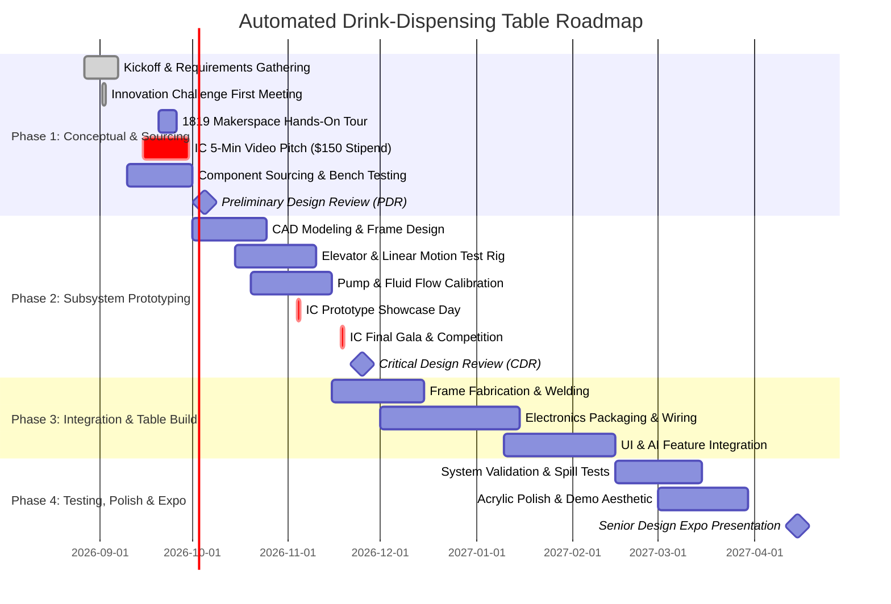

# Project Timeline & Milestone Tracking

> [!WARNING]
> **PRELIMINARY ESTIMATE / DRAFT TIMELINE — NOWHERE NEAR FINAL**  
> All milestone dates, Gantt durations, and sprint phase allocations are ballpark estimates to guide early planning and will be adjusted as university course dates and design deadlines are officially published.

**Lead**: Shyam (Time Management & Gantt Charts)  
**Semester Timeline**: Fall 2026 – Spring 2027 (Senior Design Cycle)  

---

## 🎯 1. Major Milestone Schedule

---

### Immediate Action Items & Course Sign-Offs (Week of Sept 2, 2026)
- [x] **Ro**: Offload Jarvis AI Assistant to 24/7 public server (Render cloud deployment complete).
- [x] **Ro**: Fix Jarvis link so URL remains permanent (`https://avengers-jarvis.onrender.com`).
- [x] **All Members**: Attend CEAS Innovation Challenge Kickoff Meeting (Sept 2 @ 5:30 PM, Kautz Attic).
- [ ] **All Members**: Submit Innovation Challenge registration form via Teams.
- [ ] **All Members**: Join the Innovation Challenge Canvas course.
- [ ] **All Members**: Complete Student-Initiated Project Document (Due: **Tonight, Sept 2**).
- [ ] **Ro & Team**: Obtain Professor Jacob Cress sign-off and course approval.
- [ ] **All Members**: Finalize & submit neutral project description (*"a device or system that will automatically pour a user-influenced beverage from a selection of available drink options"*).
- [ ] **Eli**: Create component inventory checklist and upload to Google Drive (Target: **Sept 4**).
- [ ] **Aron**: Set up Purchase Request Excel for 1819 Makerspace material reimbursement.
- [ ] **Team**: Record and submit 5-Minute Pitch Deck Video (Due: **September 30, 2026** — unlocks $150 stipend).

### Milestone 1: PDR & Benchtop Proof-of-Concept (Target: Oct 2026)
- [ ] Requirements document finalized (speed, cup capacity, power draw).
- [ ] Innovation Challenge submission completed.
- [ ] Benchtop test: Single pump dosing calibrated volume (±5% accuracy).
- [ ] Benchtop test: Stepper motor moving carriage vertically with limit switches.

### Milestone 2: CDR & Integrated Alpha Prototype (Target: Dec 2026)
- [ ] Complete SolidWorks/Fusion 360 table CAD model and FEA.
- [ ] Full 4-pump dispensing manifold assembled and tested.
- [ ] Microcontroller state machine handling full sequence (Drop -> Fill -> Raise).
- [ ] Initial web/touchscreen UI operational.

### Milestone 3: Final Expo System & Senior Design Expo (Target: April 2027)
- [ ] Table furniture housing completely assembled with clear viewing acrylic.
- [ ] Integrated AI drink recommendation / voice commands active.
- [ ] Final Capstone Report, Poster, and Video Presentation.
