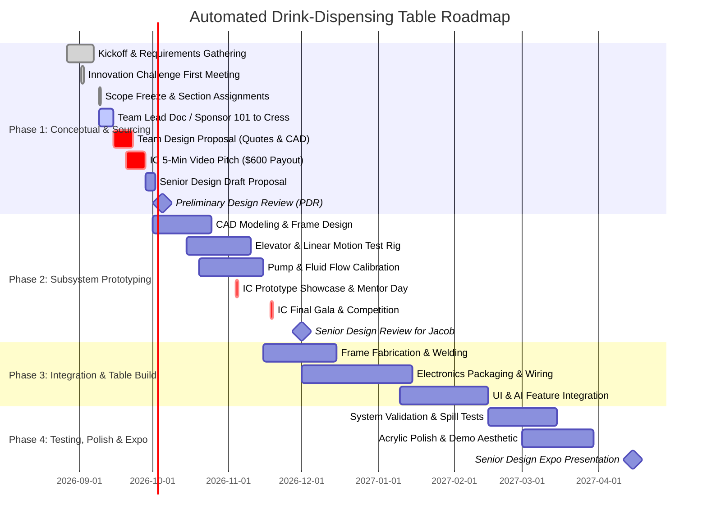

# Project Timeline & Milestone Tracking

> [!WARNING]
> **PRELIMINARY ESTIMATE / DRAFT TIMELINE — NOWHERE NEAR FINAL**  
> All milestone dates, Gantt durations, and sprint phase allocations are ballpark estimates to guide early planning and will be adjusted as university course dates and design deadlines are officially published.

**Lead**: Shyam (Time Management & Gantt Charts)  
**Semester Timeline**: Fall 2026 – Spring 2027 (Senior Design Cycle)  

---

## 🎯 1. Major Milestone Schedule

---

### Immediate Action Items & Deadlines (Sept 9 – Sept 28, 2026)
- [x] **Ro**: Offload Jarvis AI Assistant to 24/7 cloud server (`https://avengers-jarvis.onrender.com`).
- [x] **Ro**: Deploy permanent, non-expiring GitHub API token and 24/7 cloud heartbeat.
- [x] **All Members**: Attend CEAS Innovation Challenge Kickoff Meeting.
- [ ] **All Members**: Join the Innovation Challenge Canvas course (mandatory for the $300/person stipend).
- [ ] **All Members**: Submit introductory team lead / sponsor 101 doc to **Professor Jacob Cress** (Due: **Sept 15**).
- [ ] **All Members**: Complete Team Design Proposal by **September 23rd** (BOM with vendor quotes + section layout drawings).
- [ ] **Shyam**: Integrate September 23rd Design Proposal into Master Gantt Chart (**TOP PRIORITY**).
- [ ] **Eli**: Electrical section lead (PLC, 24V DC power supply, relays, wiring layout).
- [ ] **Eli & Shyam**: Lift mechanism lead (Z-axis linear rail, motor, pulley/belt or lead screw drive).
- [ ] **Ro & Aron**: Bottling & fluidics lead (8-bottle 2x4 array, peristaltic pumps, flow regulators, rubber corks).
- [ ] **Shyam & Eli**: Ice/thermal research (reusable metal ice cubes vs. mini chiller).
- [ ] **Aron**: Set up Purchase Request Excel for Innovation Chair authorization prior to any material purchases.
- [ ] **Team**: Record and submit 5-Minute Pitch Deck Video by **September 28th** ($600 team payout).
- [ ] **Cadence**: Meet **twice weekly** moving forward — immediately before and after Wednesday 1:30 PM class.

### Milestone 1: PDR & Benchtop Proof-of-Concept (Target: Oct 2026)
- [ ] Requirements document finalized (speed, cup capacity, power draw).
- [ ] Innovation Challenge submission completed.
- [ ] Benchtop test: Single pump dosing calibrated volume (±5% accuracy).
- [ ] Benchtop test: Stepper motor moving carriage vertically with limit switches.

### Milestone 2: CDR & Integrated Alpha Prototype (Target: Dec 2026)
- [ ] Complete SolidWorks/Fusion 360 table CAD model and FEA.
- [ ] Full 4-pump dispensing manifold assembled and tested.
- [ ] Microcontroller state machine handling full sequence (Drop -> Fill -> Raise).
- [ ] Initial web/touchscreen UI operational.

### Milestone 3: Final Expo System & Senior Design Expo (Target: April 2027)
- [ ] Table furniture housing completely assembled with clear viewing acrylic.
- [ ] Integrated AI drink recommendation / voice commands active.
- [ ] Final Capstone Report, Poster, and Video Presentation.
